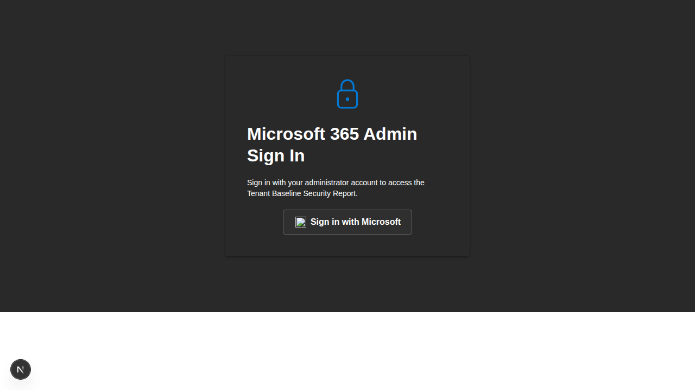
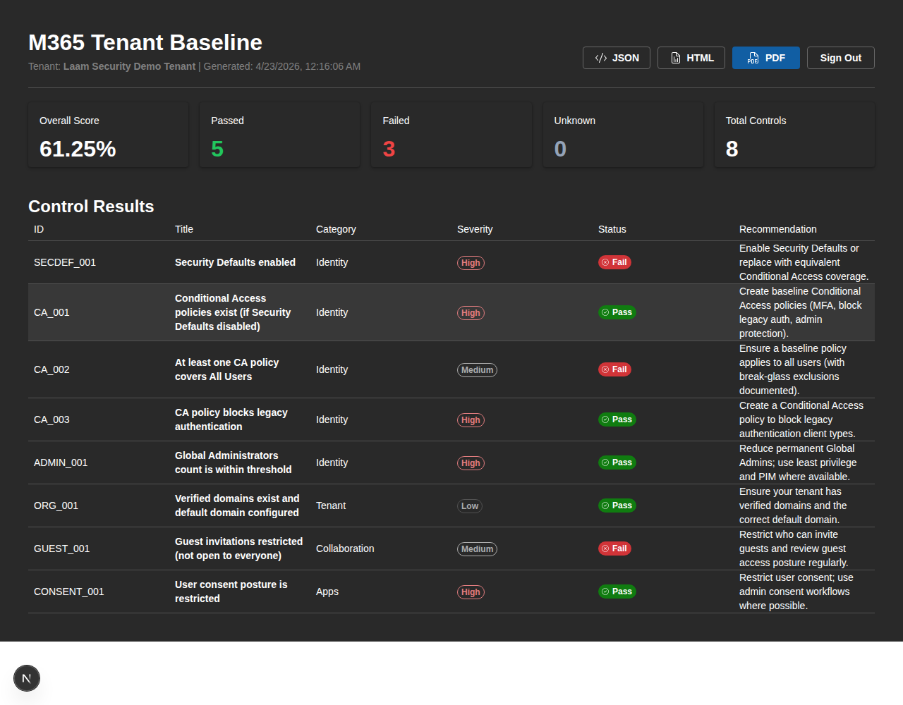

# M365 Baseline Dashboard (Next.js & Fluent UI v9)

This is a modern web-based dashboard for the M365 Tenant Baseline Reporter, built with Next.js 15 and Fluent UI v9.

## Features
- **Admin Sign-In**: Mock authentication flow for Microsoft administrators.
- **Real-time Assessment**: Visual summary of tenant security posture.
- **Multi-format Export**:
  - **JSON**: Raw findings for automation.
  - **HTML**: Self-contained report for sharing.
  - **PDF**: Formal document layout with recommendations.

## Screenshots

### Sign In


### Dashboard


## Getting Started

1. Navigate to the dashboard directory:
   ```bash
   cd m365-baseline-dashboard
   ```

2. Install dependencies:
   ```bash
   npm install
   ```

3. Run the development server:
   ```bash
   npm run dev
   ```

4. Open [http://localhost:3000](http://localhost:3000) in your browser.

## Tech Stack
- **Framework**: Next.js 15 (App Router)
- **UI Components**: Fluent UI React v9
- **Icons**: Fluent UI System Icons
- **PDF Generation**: jsPDF & jsPDF-AutoTable
- **Language**: TypeScript
